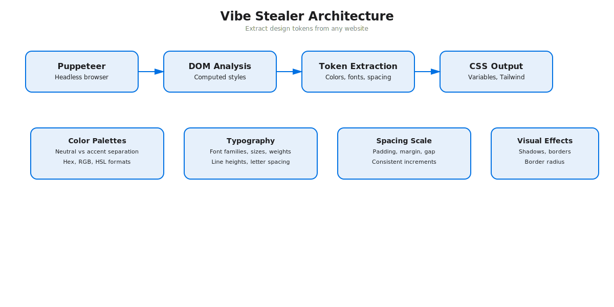

# Vibe Stealer

Extract design aesthetics (colors, fonts, spacing, shadows) from any website and convert them into reusable design tokens.



## Features

- Scrapes websites using Puppeteer (bypasses JS requirements)
- Analyzes computed styles from DOM
- Extracts color palettes (separates neutral vs accent colors)
- Identifies typography systems (fonts, sizes, weights)
- Captures spacing scales (padding, margin, gap)
- Detects visual effects (shadows, borders, border-radius)
- Outputs in multiple formats: CSS variables, Tailwind config, JSON

## Installation

```bash
npm install
```

## Usage

### Basic usage (CSS output)
```bash
node index.js https://stripe.com
```

### Output formats
```bash
# CSS variables (default)
node index.js https://stripe.com --format css

# Tailwind config
node index.js https://stripe.com --format tailwind

# JSON (programmatic use)
node index.js https://stripe.com --format json
```

### Save to file
```bash
node index.js https://stripe.com -o stripe-vibe.css
node index.js https://linear.app -o linear-vibe.js --format tailwind
```

### Run browser in visible mode (for debugging)
```bash
node index.js https://vercel.com --headless false
```

### Auto-integrate into all Code projects (NEW)
```bash
node index.js https://tryalcove.com --integrate
```
This will:
1. Extract the design tokens
2. Save to `~/Documents/Code/nulljosh.github.io/design-tokens.css`
3. Copy to all web projects (bread, wikiscroll, checkcheck, etc.)
4. You just need to link it in each project's HTML and replace hardcoded styles

## Output Examples

### CSS Variables
```css
:root {
  /* Colors */
  --color-primary: #0071e3;
  --color-secondary: #5e5ce6;
  --color-accent-1: #ff3b30;
  --color-neutral-1: #1d1d1f;
  --color-neutral-2: #86868b;

  /* Typography */
  --font-primary: -apple-system;
  --text-xs: 12px;
  --text-sm: 14px;
  --text-base: 16px;
  --text-lg: 18px;

  /* Spacing */
  --space-0: 0px;
  --space-1: 4px;
  --space-2: 8px;
  --space-4: 16px;

  /* Effects */
  --shadow-sm: 0 1px 2px rgba(0, 0, 0, 0.05);
  --shadow-md: 0 4px 6px rgba(0, 0, 0, 0.1);
  --radius: 4px;
}
```

### Tailwind Config
```javascript
module.exports = {
  theme: {
    extend: {
      colors: {
        primary: "#0071e3",
        secondary: "#5e5ce6",
        accent: { "1": "#ff3b30", "2": "#ff9500" }
      },
      fontFamily: {
        sans: ["-apple-system", "sans-serif"]
      },
      spacing: {
        "0": "0px",
        "1": "4px",
        "2": "8px",
        "4": "16px"
      }
    }
  }
}
```

## How It Works

1. **Scraper** (`lib/scraper.js`): Launches Puppeteer, loads the page, extracts computed styles from all visible DOM elements
2. **Analyzer** (`lib/analyzer.js`): Processes raw styles, finds patterns, separates neutral/accent colors, creates design scales
3. **Formatter** (`lib/formatter.js`): Converts analyzed data into CSS variables, Tailwind config, or JSON

## Test Sites

Works great on:
- Stripe (clean, minimal)
- Linear (modern SaaS)
- Vercel (dark mode, gradients)
- Apple (premium, refined)
- Tailwind CSS (utility-first)

## Architecture

```
vibe-stealer/
├── index.js              # CLI entry point
├── lib/
│   ├── scraper.js        # Puppeteer page loader + style extraction
│   ├── analyzer.js       # Style analysis algorithms
│   └── formatter.js      # CSS/Tailwind/JSON output generation
├── examples/             # Example outputs
└── package.json
```

## Roadmap

- [ ] Screenshot mode (analyze uploaded images instead of URLs)
- [ ] AI vision integration (GPT-4V for aesthetic analysis)
- [ ] Figma tokens export
- [ ] SCSS/SASS output
- [ ] Component detection (buttons, cards, forms)
- [ ] Dark mode detection
- [ ] Animation extraction

## Related Tools

See also: `fetch-tweet.js` in finn/scripts for Twitter content scraping
